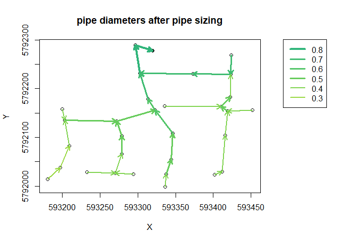
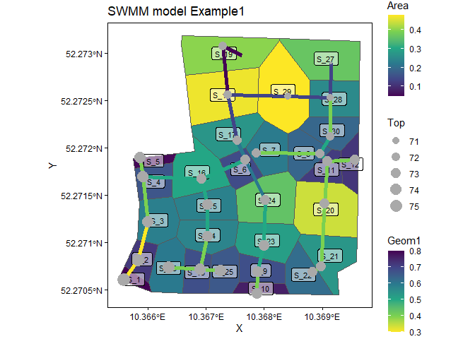

[](https://github.com/DoeringA/urbandrain/actions?query=workflow%3AR-CMD-check)
[](https://github.com/DoeringA/urbandrain/actions?query=workflow%3Apkgdown)


urbandrain
================

This R package provides functions to automatically generate a stormwater
drainage network. The aim is to keep existing urban structures and
rebuild the pipe system as close to reality as possible. Since public
drainage pipes are arranged in the road cross-section as gravity driven
open channels, we setup the drainage network below the existing streets
and define flow directions following the surface topology. Required
input data are publicly available. The result is a SWMM input file
including a complete drainage network model with discharging surfaces,
junctions, conduits and outfalls.

For further details on the input data please view vignette: [How to
extract and preprocess input data from open
source](How_to_extract_and_preprocess_input_data_from_open_source.html).
For further information on the usage of the functions provided by the
package please view vignette: [How to built a drainage network model
using
urbandrain](How_to_built_a_drainage_network_model_using_urbandrain.html)

## Installation

You can install the package from github with:

``` r
# install.packages("remotes")
remotes::install_github("DoeringA/urbandrain")
```

## Example

The package includes an example case containing input information and
the final inp file. The required input data can be downloaded from open
source plattforms (see vignettes).

``` r
# install required packages:
library(urbandrain)
remotes::install_github("DoeringA/swmmr@read_sf_to_inp")

# load example dataset containing input data:
data(ex1, package = "urbandrain")

# show input data summary:
summary(ex1)
```

    ##                    Length Class       Mode
    ## boundary_polygon    2     sf          list
    ## streets             4     sf          list
    ## landuse             2     sf          list
    ## landuse_classes     2     data.frame  list
    ## dtm                 1     RasterLayer S4  
    ## outfall             4     sf          list
    ## infiltration        6     tbl_df      list
    ## network_parameters 18     data.frame  list

``` r
# load paths to external input data:
path_raintimeseries <- system.file("extdata", "default_rain.dat", package = "urbandrain")
path_options <- system.file("extdata", "options.txt", package = "urbandrain")

# define a directory to write the output to:
path_out_temp <- tempdir()

# run function to generate a drainage network in SWMM's inp file format:
# (for information on the function arguments view the vignettes and/or the documentation)
network_list <- create_swmm_model(
  streets = ex1$streets,
  dtm = ex1$dtm,
  outfalls = ex1$outfall,
  crs_default = ex1$network_parameters$crs_default,
  buffer = ex1$network_parameters$buffer, 
  snap_dist = ex1$network_parameters$snap_dist, 
  epsilon = ex1$network_parameters$epsilon, 
  lim = ex1$network_parameters$lim,  
  min_junc_depth = ex1$network_parameters$min_junc_depth, 
  mean_junc_depth = ex1$network_parameters$mean_junc_depth, 
  max_junc_depth = ex1$network_parameters$max_junc_depth,  
  min_slope = ex1$network_parameters$min_slope, 
  max_slope = ex1$network_parameters$max_slope, 
  ds = ex1$network_parameters$ds,
  stepwise = TRUE, 
  break_closed_loops = FALSE,  
  delete_disconnected = FALSE, 
  breaks_at_hills = TRUE, 
  break_loops = TRUE,  
  short_cut_sinks = TRUE, 
  direct_drainage_sinks = FALSE,
  boundary_polygon = ex1$boundary_polygon, 
  landuse_sf = ex1$landuse,
  landuse_classes = ex1$landuse_classes, 
  path_timeseries = system.file("extdata", "default_rain.dat", package = "urbandrain"),
  path_options = system.file("extdata", "options.txt", package = "urbandrain"),
  infiltration = ex1$infiltration,
  path_out = path_out_temp
)
```

    ## Writing layer `links_artificial_SWMM_format' to data source `C:/Anneke/rtemp\Rtmp4Y0NVc/links_artificial_SWMM_format.shp' using driver `ESRI Shapefile'
    ## Writing 30 features with 11 fields and geometry type Line String.



``` r
# show summary of the final artificially generated drainage network:
summary(network_list)
```

    ##               Length Class Mode
    ## junctions      8     sf    list
    ## conduits      12     sf    list
    ## outfalls       4     sf    list
    ## subcatchments 10     sf    list
    ## inp           14     inp   list

### Visualization of model structure

With help of packages ‘ggplot2’, ‘sf’ and ‘swmmr’ we can plot entire
swmm models. The following plotting code was inspired by [Dominik
Leutnant](https://github.com/dleutnant/swmmr).

``` r
library(ggplot2)

# calculate coordinates (centroid of subcatchment) for label position
centroids <- sf::st_centroid(network_list$subcatchments)
```

    ## Warning in st_centroid.sf(network_list$subcatchments): st_centroid assumes
    ## attributes are constant over geometries of x

``` r
lab_coord <- tibble::as_tibble(sf::st_coordinates(centroids))
  
# add label coordinates to subcatchments
network_list$subcatchments <- dplyr::bind_cols(network_list$subcatchments, lab_coord)

# create the plot
ggplot() + 
  # first plot the subcatchment and colour continously by Area
  geom_sf(data = network_list$subcatchments, aes(fill = Area)) + 
  # label by subcatchments by name
  geom_label(data = network_list$subcatchments, aes(X, Y, label = Name), alpha = 0.5, size = 3) +
  # add links and highlight Geom1
  geom_sf(data = network_list$conduits, aes(colour = Geom1), size = 2) +
  # add junctions
  geom_sf(data = network_list$junctions, aes(size = Top), colour = "darkgrey") + 
  # change scales
  scale_fill_viridis_c() +
  scale_colour_viridis_c(direction = -1) +
  # change theme
  theme_linedraw() +
  theme(panel.grid.major = element_line(colour = "white")) +
  # add labels
  labs(title = "SWMM model Example1")
```


